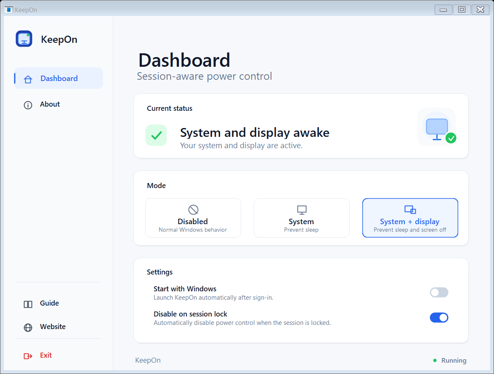

# KeepOn

[](dist/v1.6.0)
[](LICENSE)
[](#runtime)

KeepOn is a small Windows tray application for temporarily keeping your PC awake.
It uses the native Windows Power Request API, so it does not simulate mouse
movement, press keys, run hidden browser tabs, or use any workaround activity.

The app is designed for simple desktop use: start it, choose a mode from the
tray icon or control panel, and switch it off when you no longer need it.



## Highlights

- Runs quietly in the Windows notification area.
- Can keep only the system awake, or keep both the system and display awake.
- Can disable active power requests automatically when the Windows session is locked.
- Supports Start with Windows for the current user.
- Includes a modern control panel with Dashboard, Guide and About views.
- Stores settings locally and does not require an account or network access.
- Built for Windows with .NET 10 and Windows Forms.

## Modes

| Mode | What it does | Typical use |
| --- | --- | --- |
| Disabled | KeepOn does not hold any power request. Windows follows its normal sleep and display settings. | Daily default state. |
| System | Prevents system sleep. The display may still turn off according to Windows settings. | Long downloads, background jobs, remote sessions, local scripts. |
| System + display | Prevents system sleep and keeps the display awake. | Monitoring dashboards, presentations, visible progress windows. |

## Settings

| Setting | Description |
| --- | --- |
| Start with Windows | Adds KeepOn to the current user's Windows startup entry. |
| Disable on session lock | Clears active power requests when the Windows session is locked. |

The session-lock option is enabled by default in the current app flow because it is
a safer behavior for normal workstation use.

## Download Variants

Ready-to-download ZIP files are included in this repository under
[`dist/v1.6.0`](dist/v1.6.0).

| Download | .NET required on target PC | Notes |
| --- | --- | --- |
| [KeepOn-portable-self-contained-win-x64.zip](dist/v1.6.0/KeepOn-portable-self-contained-win-x64.zip) | No | Easiest option for moving between machines. |
| [KeepOn-portable-compressed-win-x64.zip](dist/v1.6.0/KeepOn-portable-compressed-win-x64.zip) | No | Smaller self-contained build, may start slightly slower. |
| [KeepOn-framework-dependent-win-x64.zip](dist/v1.6.0/KeepOn-framework-dependent-win-x64.zip) | Yes, .NET 10 Desktop Runtime | Smallest download, best for your own machines with .NET installed. |

The same variants can also be generated locally:

| Variant | Local publish output |
| --- | --- |
| Portable self-contained | `artifacts\publish\portable-self-contained\KeepOn.exe` |
| Portable compressed | `artifacts\publish\portable-compressed\KeepOn.exe` |
| Framework-dependent | `artifacts\publish\framework-dependent\KeepOn.exe` |

## Installation

KeepOn does not require a traditional installer.

1. Choose one of the published `KeepOn.exe` variants.
2. Copy it to your preferred application folder, for example:

   ```text
   D:\Program Files\KeepOn\KeepOn.exe
   ```

3. Run `KeepOn.exe`.
4. Open the tray icon or control panel.
5. Enable `Start with Windows` if you want KeepOn to start after sign-in.

If you move `KeepOn.exe` to another folder and use autostart, open KeepOn once
from the new location and toggle `Start with Windows` off and on again. This
updates the Windows startup entry to the new path.

## Usage

After launching KeepOn, use the tray icon or the control panel:

- `Dashboard` shows the current mode and quick settings.
- `Guide` explains modes and actions inside the app.
- `About` shows version and project information.
- `Website` opens [domindev.com](https://domindev.com).
- `Exit` closes KeepOn and clears active power requests.

When KeepOn exits, it releases any active power request before the process closes.

## Privacy

KeepOn is local-only by design.

- It does not collect telemetry.
- It does not require login.
- It does not send settings anywhere.
- It does not monitor keyboard, mouse, applications, windows, browser activity, or files.
- It only uses Windows APIs needed for tray UI, startup registration, session lock detection and power requests.

## Local Data

KeepOn stores settings and logs under the current Windows user profile:

```text
%LOCALAPPDATA%\KeepOn\
%LOCALAPPDATA%\KeepOn\settings.json
%LOCALAPPDATA%\KeepOn\Logs\
```

For compatibility with early builds, KeepOn can migrate settings or startup data
from the previous internal name `DominTray`. New data is stored under `KeepOn`.

## Verify Active Power Requests

Windows can show active power requests with:

```powershell
powercfg /requests
```

Expected behavior:

- In `Disabled`, there should be no active `KeepOn.exe` entries.
- In `System`, `KeepOn.exe` should appear under `SYSTEM`.
- In `System + display`, `KeepOn.exe` should appear under `SYSTEM` and `DISPLAY`.

## Build From Source

Requirements:

- Windows 11 x64
- .NET 10 SDK

Build:

```powershell
dotnet build .\KeepOn.slnx -c Release
```

Publish all variants:

```powershell
.\publish-all.ps1
```

Publish outputs:

```text
artifacts\publish\portable-self-contained\KeepOn.exe
artifacts\publish\framework-dependent\KeepOn.exe
artifacts\publish\portable-compressed\KeepOn.exe
```

## Release Automation

This repository includes a GitHub Actions workflow that builds all release
variants and attaches ZIP files to a GitHub Release.

Create a release by pushing a version tag:

```powershell
git tag v1.6.0
git push origin v1.6.0
```

You can also run the `Release` workflow manually from GitHub Actions and provide
the release tag.

## Changelog

See [CHANGELOG.md](CHANGELOG.md).

## Project Metadata

| Field | Value |
| --- | --- |
| Product name | KeepOn |
| File description | KeepOn |
| Company | DominDev |
| Website | https://domindev.com |
| Version | 1.6.0 |
| File version | 1.6.0.0 |
| Runtime | .NET 10 |
| UI | Windows Forms |

## Troubleshooting

### KeepOn does not start with Windows

Open KeepOn manually and toggle `Start with Windows` off and on again. The app
stores startup configuration in:

```text
HKCU\Software\Microsoft\Windows\CurrentVersion\Run
```

The entry should point to the current `KeepOn.exe` path.

### Windows still sleeps

Check that the selected mode is not `Disabled`, then run:

```powershell
powercfg /requests
```

If there is no `KeepOn.exe` entry, restart KeepOn and select the mode again.

### The app was moved to another folder

If autostart was enabled before moving the executable, toggle `Start with Windows`
off and on again from the new location.

### Antivirus warning

KeepOn is an unsigned desktop executable, so Windows or antivirus tools may treat
new builds with extra caution until they build reputation. Code signing can reduce
these warnings, but the app itself does not perform stealthy behavior, network
communication, injection, encryption, persistence outside the current user's Run
key, or input simulation.

## License

KeepOn is released under the MIT License. See [LICENSE](LICENSE).
